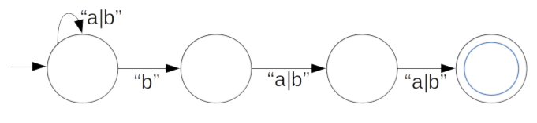

# Finite Automata

A finite automata is a collection of *states* and *rules* for
transitioning from one state to the next.  That's it.  Finite automata
are the most common tools used for describing regular expressions, and
most of the research into regular expressions has been to determine the
best way to make an efficient automata, and the best way to encode the
results of that automata.

Here's an example automata:

This automata, in the common dialect of regular expressions, recognizes
this string: ".\*aab.\*", where "a" and "b" are the only letters allowed
in the string.  We enter the expression at the left and any number of
'b's will keep the machine in the first state; an 'a' will send us to
the second state, another 'a' will send us to the third state, and then
any number of 'a's are fine until we hit a 'b', at which point we're in
the end state, which loops infinitely until the string runs out.  The
state at the end with the double-ring indicates the "accept" state; that
is, the DFA has "accepted" a string if the DFA is in this state when the
string has been completely analyzed.

This particular example is said to be *deterministic*, and I'll use the
common term "DFA" for "Deterministic Finite Automata" from now on.
DFAs are "deterministic" in the sense that for every given state change,
*exactly one* transition is followed and *exactly one* node is
considered active at any given time.

An alternative to DFAs are *non-deterministic finite automata*, or
NFA.  An NFA can have multiple states active at once, and multiple
transition rules covering when to move from one state to the next.

Here's a very simple example NFA:

All this rule does is state that the third letter from the end must be a
'b'.  But you'll notice that, since any number of 'b's may proceed, if
your string is "bbbb" then at some point *all four states* will be
active.  That's fine.  As long as an "accept" node (again, the one with
the double ring) is active when the end of the string is reached, the
automata has accepted the string.

# Regular Expressions and FAs

Every regular expression can be converted into an NFA, and every NFA can
be converted into a DFA.  Regular expressions themselves are unwieldy
and inefficient; turning them into an FA makes it much easier to both
understand what the machine is doing and to instrument the FA in a way
that allows us to extract more data from the result than just "yes" or
"no" membership.

Choosing one over the other is a programmer's job, and most modern
regular expression engines use a "both-plus" strategy.  In the most
powerful regular expression engines, such as Google's RE2, Rust's Regex,
and Perl's PCRE, the expression is parsed and costed.

A DFA with many complex sequences can result in that exponential
explosion of nodes discussed in the last entry, which in turn can be
memory-expensive.  NFAs, in contrast, can encode such nodes in a
straightforward manner, and the table for tracking node activation will
only ever be as large as the whole NFA, but the cost of scanning the
table for every letter analyzed increases the runtime by a small amount.

There are also "regex" engines that handle expression Kleene's algebra
cannot.  Perl's backreferences, for example, leave part of the NFA and
DFA blank until such time as the reference has been matched, and then
"splices in" the sequence found for later matching.  For these
occasions, regex engines employ a virtual machine that breaks the NFA
into individual sub-expressions and then building new parts of the NFA
on-the-fly.

# Nonregular languages

Consider the following language:

    P = { c | for every '(' in c, it is followed by a nested ')' }
    
This language can't be turned into a regular expression.  No FA exists
that can accurately describe this; it defines a process that is not
iterative, such as the loops you see above in the DFA and NFA examples,
but *recursive*; it must keep a stack of "seen" left parentheses in
order to "unwind" them as right parentheses are encountered.

# Finite State Transducer

A finite state transducer is a finite state automata that does more than
just recognize a string: it also *outputs* a string.  Each transition
produces a character, and the sequence of characters produces is the
string output.  Mechanistically, the NFA consists of a table of nodes
and a table of transition rules that also include another rule for what
to output based on the character that caused the transition.

# Weighted Finite State Transducer

A *weighted* finite state transducer is one that doesn't just have a one
to one mapping between input symbols and output symbols; instead, it has
a transformative function that maps input symbols to a different set.
They're called "weighted" because their original purposes was to
determine the probabilities of certain transition functions in
applications unrelated to regular expressions, most notably speech
recognition algorithms where the sounds being analyzed, the phonemes,
*might be* one or the other, and the weighting algorithm would assign
the likelihood of a phoneme being accurate based on the proceeding or
following phonemes, resulting in a final determination of which word was
*most likely* said.

# Semirings

In Weighted Finite State Transducers, the weighting algorithm has a
simple representation called a
[*Semiring*](https://www.encyclopediaofmath.org/index.php/Semi-ring).  A
semiring is basically a set with two operations over members of that
set, as well as two special members of the set such that the first
special member and the first operation form an identity, the second
special member and the second operation form an identity, and the first
special member with the second operation form an annhilation (always
produce the empty set).  If it sounds complicated, it's really not.

The Natural Numbers, the non-negative integers, are a semiring.  The
operations are addition and multiplication.  `n + 0 = n` is the first
identity, `n * 1` is the second identity, and `n * 0 = 0` is the
annhilation.

Boolean values, true and false, are semirings. The operations are `and`, `&&`
and 'or', `||`: `x || False = x` is the first; `x && True == x` is the
second, and `x && False` is the annhilation.

Regular expressions are semirings.  `r | {} = r` is the first identity:
the alternative between the expression `r` and an expression that never
matches is just `r`.  `r · {e} = r` is the second identity: the
concatenation of `r` with an empty string is also just `r`.  And
finally, `r · {} = {}` is the annhilation: the concatenation of r with
an expression that always fails is an expression that always fails.

And here's the most impressive part: if the output of a regular
expression can be expressed as a semiring, the you can do some
impressive things with a semiring.  If you use a Boolean semiring, then
the return value is True if "at least one path from entry to acceptance
returned 'True'."

Semirings are expressed as a tuple. Natural Numbers are (N, +, *, 0 1).
Regexes are (E, |, ·, {}, {<>}), meaning the set of strings,
alternation, concatenation, null recognizer, empty string recognizer.

Categorically, we can define a homomorphism between two Semirings, so if
we map the Regex semiring to the natural numbers, here's what you get:
every node that accepts returns a 1, every sequence is mapped to
multiplication, so any successful path will return 1; alternation is
mapped to addition, so the end result of this mapping is that, for a
given regex and string, *the total number of valid paths* that would be
traversed to recognize or generate that string.

Another Semiring is just: a set of strings.  The operations are just the
union of two sets of strings, and the cartesian product of two sets of
strings.  The result of *this* semiring is the set of all possible
strings extracted from the input string that led from the start to an
accept state.

# Implications

The Semiring operations don't have to look mathematically sound.  They
can be transformative, decorative, or analytical, as long as they obey
the associative and annihilative properties of semirings.  They could
recognize or label content, which makes them theoretically sound tools
for implementing capture groups, an important feature of modern regular
expressions.  The simplest outcome is a *parse tree*, but it can also be
a modified parse tree.  It can even be an AST.

